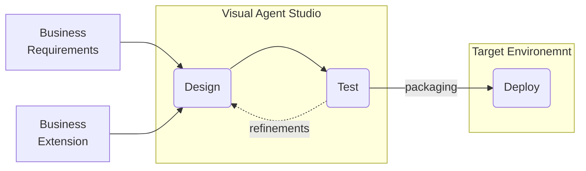

# Visual-Agent-Studio
The low-code AI business platform, to be ready for AI challenges

## Agent Workflow in the context on Generative AI (GenAI)
The term **agent workflow** in the context of Generative AI (GenAI) technology generally refers to the series of actions or processes that an AI agent follows to complete a given task. In more specific terms, it outlines the procedural steps an AI model or system takes from receiving input to producing an output. This concept is crucial in designing and implementing AI systems efficiently and effectively. 

Below a breakdown of what an agent workflow might involve in the context of GenAI:

1. **Input Reception**: The AI agent receives input, which could be text, images, data queries, or any other form of user-provided information. 
2. **Data Processing**: The input data is preprocessed for use in the AI model. This can involve cleaning the data, converting formats, or extracting relevant features needed for processing. 
3. **Model Interaction (**_**function calling**_**)**: The core of the agent’s workflow where the AI model reasoning over the input data. This stage involves the AI agent calling specific functions or methods that interface with the underlying AI models. These function calls can be to predefined libraries or custom functions that handle tasks such as processing the input, generating predictions, or retrieving data from external datasource. Each function performs a specific role and returns results for the next step. 
4. **Decision Making**: Based on the model’s processing, the AI agent makes decisions or generates responses. This can involve choosing between multiple outputs, generating new content, or performing actions within a controlled environment. 
5. **Output Generation**: The final step where the AI agent presents the results to the user. This could be in the form of text, images, decisions, or even actions taken in a digital or physical environment. 
6. **Feedback Incorporation**: In some workflows, especially those involving interactive or iterative processes, feedback from the output stage is used to refine or improve future responses.
In AI-driven systems, especially those based on Generative AI, it is very important design the agent workflow to be robust and flexible, capable of handling complex tasks and adapting to varied inputs and environments.
These workflows are fundamental in applications ranging from customer service bots and content creation tools to more complex systems like autonomous decision making and adaptive computing environments.
## Idea 💡
The idea behind **Visual Studio Agent** is to provide a  **Visual Integrated Development Environment **_(IDE)_ that facilitates the **creation**, **test** and **deployment** of Complex Agent Workflows where its users are not necessarily technical people.

>  **A key focus is on extendibility, enabling the possibility to create business tailored custom extensions to ensure flexibility and a future-proof Dev Environment** 

The goal is to manage the entire Application Lifecycle Management from requirements to deploy

## High Level Architecture ⚡️

## Key Concepts
### Extensions
Extension is one of the most important concept in the architecture. Each extension provides two components: 

1. **Client Component ( UI )** _Define how present the Node on the Workflow designer_ 
2. **Server Component ( Service )** _Define the task that will be executed when workflow engine trigger the Node_
When an extension is plugged into application the Front-End Layer use the UI Component while the Back-End Layer the Service Component.
Extensions unlock a world of endless possibilities, enabling the handling of various levels of complexity. They also allow for the determination of the granularity of such complexity, simply by implementing basic or more business-tailored extensions.

Currently we have defined three type of extensions **Agent**, **Tool**, **Action**

#### Agents
Are the extension related to AI features. An AI agent  is defined  as a computational entity designed to perform tasks that require intelligence by simulating aspects of human cognition. This involves:.

1. **Perception**: The ability to gather and interpret information from the workflow current state.
2. **Reasoning and Planning**: Making decisions based on knowledge and perception to achieve specific goals.
3. **Action**: Executing decisions through interaction with the environment.
### Tools & Actions
These represent the toolchain available  both to user to perform specific task as workflow's step than to the Agent to perform action as result of a reasoning (aka function calling).

__

__

<!--- Eraser file: https://app.eraser.io/workspace/YBJDAujV5evU4KOVWenD --->